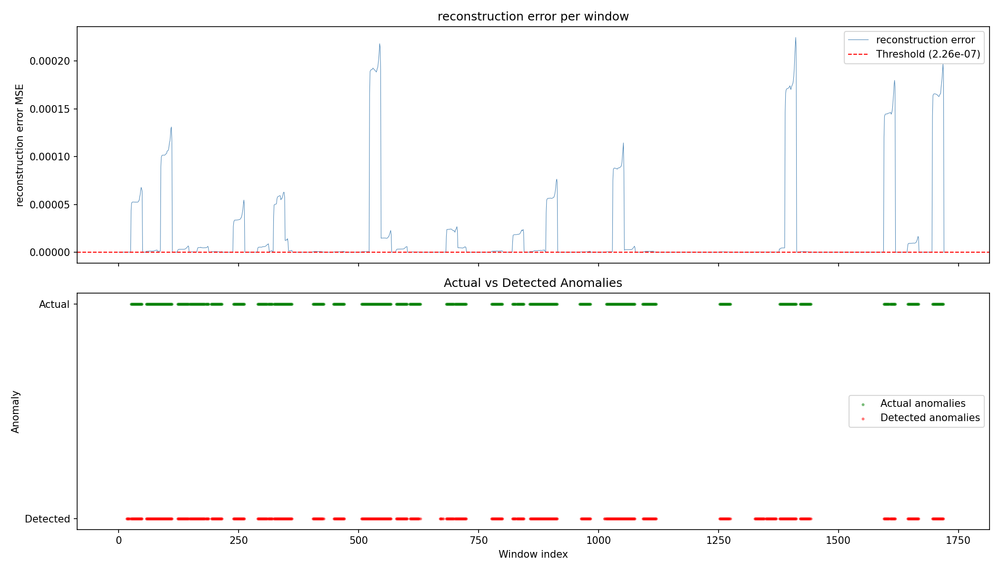

# Energy Anomaly Detector

An LSTM autoencoder trained on electricity price time series data that detects anomalous price intervals, served via a FastAPI REST endpoint and containerized with Docker.

**PyTorch · FastAPI · Docker · scikit-learn**



## Why this project

Energy systems produce continuous streams of sensor and market data where anomalies like price spikes, demand surges, equipment faults, need to be detected quickly and reliably. This project demonstrates a complete anomaly detection pipeline: from data generation and model training to a deployable REST API.

The approach generalises beyond energy prices to any system with a defined "normal" behaviour, cooling systems, particle detector readings, network traffic, or infrastructure monitoring.

## How it works

The model is an LSTM autoencoder that learns to reconstruct normal electricity price patterns. It compresses a 24-hour price window into a compact hidden representation and reconstructs it. Windows that deviate from learned patterns produce high reconstruction error, which serves as the anomaly signal.

1. **Train on normal data only** the autoencoder learns what typical daily price curves look like
2. **Set a threshold** the 95th percentile of training reconstruction errors defines the boundary of "normal"
3. **Flag anomalies** any window with reconstruction error above the threshold is flagged

## Results

| Metric    | Score  |
|-----------|--------|
| Precision | 0.9324 |
| Recall    | 0.9845 |
| F1 Score  | 0.9577 |

The model catches 98% of anomalies (recall) with 93% precision, meaning most flagged windows are true anomalies.

## Project structure

```
energy-anomaly-detector/
├── src/
│   ├── fetch_data.py      # Synthetic price data generation
│   ├── preprocess.py       # Scaling, windowing, train/test split
│   ├── model.py            # LSTM autoencoder architecture (PyTorch)
│   ├── train.py            # Training loop and threshold calculation
│   └── evaluate.py         # Metrics and anomaly plot
├── api.py                  # FastAPI REST endpoint
├── Dockerfile              # Container configuration
├── requirements.txt        # Python dependencies
└── notebooks/
    └── exploration.ipynb   # Development journal
```

## Quick start

### Run locally

```bash
# Install dependencies
pip install -r requirements.txt

# Generate data, preprocess, train, and evaluate
python src/fetch_data.py
python src/preprocess.py
python src/train.py
python src/evaluate.py

# Start the API
uvicorn api:app --reload
```

### Run with Docker

```bash
docker build -t energy-anomaly-detector .
docker run -p 8000:8000 energy-anomaly-detector
```

### Test the API

Send a normal 24-hour price window:

```bash
curl -X POST http://localhost:8000/predict \
  -H "Content-Type: application/json" \
  -d '{"prices": [40,38,35,33,32,31,33,38,44,46,45,43,42,41,40,42,44,48,47,45,43,41,39,38]}'
```

Response:

```json
{
  "reconstruction_error": 1.24e-07,
  "threshold": 2.26e-07,
  "is_anomaly": false
}
```

Send a window with a price spike:

```bash
curl -X POST http://localhost:8000/predict \
  -H "Content-Type: application/json" \
  -d '{"prices": [40,38,35,33,32,31,33,38,44,46,45,180,42,41,40,42,44,48,47,45,43,41,39,38]}'
```

Response:

```json
{
  "reconstruction_error": 8.50e-05,
  "threshold": 2.26e-07,
  "is_anomaly": true
}
```

## Technical details

- **Data**: 8,760 hours (one year) of synthetic electricity spot prices modelled on Nordic/Danish market structure with daily and weekly seasonality, Gaussian noise, and 2% injected anomaly spikes
- **Preprocessing**: MinMaxScaler fitted on training split only (no data leakage), sliding windows of 24 hours
- **Model**: LSTM autoencoder, encoder compresses 24 timesteps into a 32-dimensional hidden state, decoder reconstructs from it
- **Training**: 50 epochs, batch size 64, Adam optimiser, MSE loss, trained on normal windows only
- **Threshold**: 95th percentile of training reconstruction errors
- **API**: FastAPI with `/predict` and `/health` endpoints
- **Deployment**: Dockerized with python:3.11-slim base image

## Author

Peter — BSc Computer Science, Aalborg University
